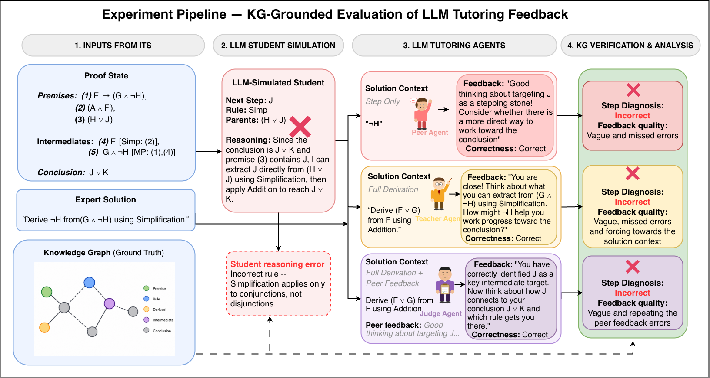

# BEA 2026 — Confirming Correct, Missing the Rest

Code and data accompanying the paper:

> **Confirming Correct, Missing the Rest: LLM Tutoring Agents Struggle Where Feedback Matters Most.**
> Tahreem Yasir, Wenbo Li, Sam Gilson, Sutapa Dey Tithi, Xiaoyi Tian, Tiffany Barnes. BEA 2026.



We benchmark seven LLM feedback agents on step-level diagnosis in propositional logic, using a knowledge-graph (KG) derived ground truth that distinguishes **optimal**, **valid-alternative**, and **incorrect** student steps across three feedback conditions (Peer / Teacher / Judge). The pipeline produces 10,836 solution–feedback pairs (516 proof states × 7 models × 3 conditions).

## Repository layout

```
.
├── Data/
│   ├── cleaned_data/preState.jsonl   # 516 proof states used in the study
│   ├── props/   # per-problem propositions (CSV)
│   ├── num/     # per-problem numbered statements (CSV)
│   └── map/     # proposition → statement maps (JSON)
└── dt_code/
    ├── KG/                       # KG construction & traversal (Neo4j)
    ├── preprocessing/            # tutor-log cleaning, CSV→JSON, proof-state extraction
    ├── prompts_i+2/              # student / teacher / judge prompt templates (YAML)
    ├── llm_response_processing/  # response parsing, step verification against KG
    ├── GPT/ GPT-o3/ gemini/ mistral/ qwen/ llama3/ deepseek2/ magistral/  # per-model runners
    └── llm_response_processing/  # shared evaluation utilities
```

Each per-model directory follows the same convention:
- `*_interface.py` — API wrapper for that model.
- `*_baseline_1.py` — Peer condition (next step only).
- `*_baseline_2.py` — Teacher condition (full derivation).
- `*_ours.py` / `*_ours_2.py` — Judge / verification condition.
- `csv_*.py` — exports JSONL runs to CSV for analysis.
- `comparison*.ipynb`, `ped_metrics*.py` — three-way classification metrics, OR / OV, and per-rubric scoring.

## Setup

```bash
python -m venv .venv && source .venv/bin/activate
pip install -r requirements.txt   # neo4j, openai, anthropic, google-generativeai, groq, mistralai, python-dotenv, pandas, jupyter
```

Copy `.env.example` to `.env` and fill in:

```
OPENAI_API_KEY=...
GOOGLE_API_KEY=...
GROQ_API_KEY=...        # LLaMA-3.3-70B, Qwen-3-32B
MISTRAL_API_KEY=...
OPENROUTER_API_KEY=...  # DeepSeek-R1
NEO4J_URI=neo4j+s://...
NEO4J_USERNAME=...
NEO4J_PASSWORD=...
```

The KG is stored in Neo4j; a free Aura instance is sufficient.

## Reproducing the pipeline

1. **Build the KG** for the 32 proof problems:
   ```bash
   python -m dt_code.KG.KG_create
   ```
2. **Generate student solutions and Peer / Teacher feedback** for one model (example: GPT-4.1):
   ```bash
   python -m dt_code.GPT.gpt_baseline_1   # Peer
   python -m dt_code.GPT.gpt_baseline_2   # Teacher
   ```
3. **Run the Judge / verifier**:
   ```bash
   python -m dt_code.GPT.gpt_ours
   ```
4. **Evaluate** against the KG and compute metrics:
   ```bash
   python -m dt_code.GPT.ped_metrics_updated
   ```
   Three-way classification, over-rejection (OR), and over-validation (OV) are reported in the `comparison*.ipynb` notebooks.

All experiments use `temperature=0.0` for determinism. Prompt templates are in [`dt_code/prompts_i+2/`](dt_code/prompts_i+2/).

## Citation

```bibtex
@inproceedings{yasir2026confirming,
  title  = {Confirming Correct, Missing the Rest: LLM Tutoring Agents Struggle Where Feedback Matters Most},
  author = {Yasir, Tahreem and Li, Wenbo and Gilson, Sam and Tithi, Sutapa Dey and Tian, Xiaoyi and Barnes, Tiffany},
  booktitle = {Proceedings of the 21st Workshop on Innovative Use of NLP for Building Educational Applications (BEA)},
  year   = {2026}
}
```

## License & data

Student interaction data was collected under IRB approval with informed consent and anonymized before analysis. See the paper's Ethics Statement and Limitations for scope of release.
